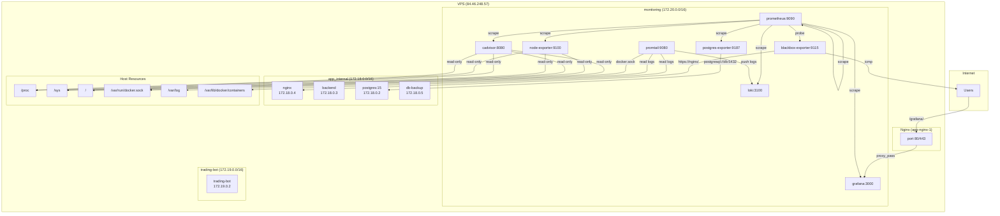
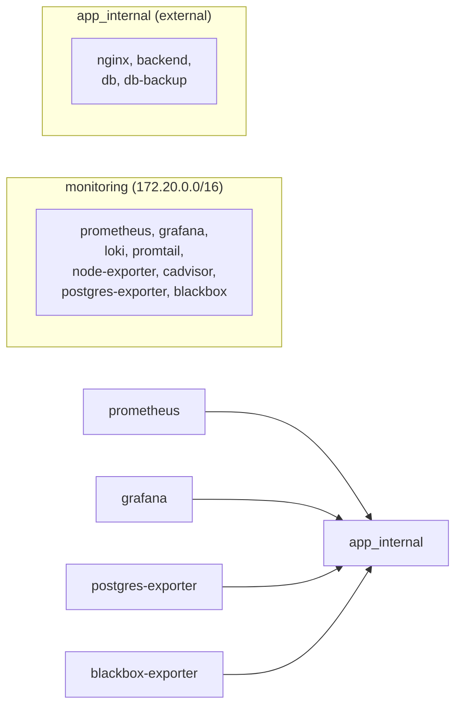

# Production Observability Stack

## Architecture



## Directory Structure

```
/opt/monitoring/
├── docker-compose.yml          # Main compose file
├── .env                        # Environment variables (secrets)
├── prometheus/
│   ├── prometheus.yml          # Scrape config
│   └── rules/
│       └── alerts.yml          # Alert rules
├── loki/
│   └── loki-config.yml         # Loki config
├── promtail/
│   └── promtail-config.yml     # Promtail config
├── blackbox/
│   └── blackbox.yml            # Blackbox exporter config
├── grafana/
│   ├── provisioning/
│   │   ├── datasources/        # Auto-provisioned datasources
│   │   └── dashboards/         # Dashboard provisioning config
│   └── dashboards/             # Dashboard JSON files
├── scripts/
│   ├── download-dashboards.sh  # Dashboard downloader
│   └── grafana-proxy.conf      # Nginx proxy config snippet
└── README.md                   # This file
```

## Services

| Service | Image | Version | Port | Purpose |
|---|---|---|---|---|
| prometheus | prom/prometheus | v2.53.0 | 9090 | Metrics storage & alerting |
| grafana | grafana/grafana | 11.1.0 | 3000 | Dashboards & visualization |
| loki | grafana/loki | 3.0.0 | 3100 | Log aggregation |
| promtail | grafana/promtail | 3.0.0 | 9080 | Log shipping |
| node-exporter | prom/node-exporter | v1.8.1 | 9100 | Host metrics |
| cadvisor | gcr.io/cadvisor/cadvisor | v0.49.1 | 8080 | Container metrics |
| postgres-exporter | prometheuscommunity/postgres-exporter | v0.15.0 | 9187 | Database metrics |
| blackbox-exporter | prom/blackbox-exporter | v0.25.0 | 9115 | External probing |

## Networking



| Network | Subnet | Driver | Services |
|---|---|---|---|
| monitoring | 172.20.0.0/16 | bridge | All 8 monitoring services |
| app_internal | 172.18.0.0/16 (external) | bridge | Prometheus, Grafana, Postgres-Exporter, Blackbox |

## Ports

| Port | Service | Public | Access |
|---|---|---|---|
| 9090 | Prometheus | ❌ Internal only | monitoring network |
| 3000 | Grafana | ✅ Via Nginx `/grafana/` | Proxy pass from nginx |
| 3100 | Loki | ❌ Internal only | monitoring network |
| 9080 | Promtail | ❌ Internal only | monitoring network |
| 9100 | Node Exporter | ❌ Internal only | monitoring network |
| 8080 | cAdvisor | ❌ Internal only | monitoring network |
| 9187 | PostgreSQL Exporter | ❌ Internal only | monitoring + app_internal |
| 9115 | Blackbox Exporter | ❌ Internal only | monitoring + app_internal |

## Volumes

| Volume | Mount | Size | Purpose |
|---|---|---|---|
| prometheus_data | /prometheus | ~1-5 GB | Time series database |
| grafana_data | /var/lib/grafana | ~500 MB | Grafana config, plugins, SQLite |
| loki_data | /loki | ~2-5 GB | Log chunks & index |
| loki_wal | /loki/wal | ~500 MB | Write-ahead log |

## Grafana

**URL:** `https://84.46.248.57/grafana/`

**Default Credentials:**

| Username | Password |
|---|---|
| admin | admin |

**Change the password immediately after first login.**

### Datasources (auto-provisioned)

| Name | UID | Type | URL |
|---|---|---|---|
| Prometheus | `prometheus` | prometheus | http://prometheus:9090 |
| Loki | `loki` | loki | http://loki:3100 |

Fixed UIDs are required for dashboard provisioning to function correctly. All downloaded dashboards reference these UIDs.

### Dashboards (auto-provisioned, 11 total)

| Dashboard | File | Source ID | Description |
|---|---|---|---|
| Node Exporter Full | NodeExporter.json | 1860 | Host CPU, memory, disk, network |
| Docker Engine | DockerEngine.json | 10566 | Docker daemon metrics |
| Docker Monitoring | DockerMonitoring.json | 893 | Container resource usage |
| cAdvisor | cAdvisor.json | 14282 | Container-level metrics |
| PostgreSQL | PostgreSQL.json | 9628 | Database performance |
| Loki | Loki.json | 13639 | Log throughput & errors |
| Prometheus | Prometheus.json | 3662 | Prometheus internals |
| Nginx | Nginx.json | 9614 | Nginx request metrics |
| Blackbox Exporter | BlackboxExporter.json | 7587 | External probe results |
| Disk and Filesystem | DiskAndFilesystem.json | 2639 | Disk usage & inodes |
| Grafana | Grafana.json | 12229 | Grafana performance |

### Dashboard Provisioning Notes

Dashboards are downloaded from grafana.com and automatically provisioned on startup. Downloaded dashboards contain hardcoded datasource UIDs from the original authors' instances. A patching script replaces these with the correct UIDs (`prometheus` or `loki`).

**If dashboards show "Datasource ... was not found" or "Failed to upgrade legacy queries":**

```bash
# Re-patch dashboard datasource references
python3 /opt/monitoring/scripts/fix-all-ds.py

# Restart Grafana to reload
docker compose up -d --force-recreate grafana
```

The patching script handles:
- `${DS_PROMETHEUS}` template variables → `prometheus` UID
- `${DS_LOKI}` template variables → `loki` UID
- Custom names like `${DS_SIGNCL-PROMETHEUS}`, `${DS_AXOOM_PROMETHEUS}`, etc.
- Legacy string-format `"datasource": "${DS_PROMETHEUS}"` → object format with UID

## Prometheus Targets

| Job | Target | Status |
|---|---|---|
| prometheus | localhost:9090 | UP |
| node-exporter | node-exporter:9100 | UP |
| cadvisor | cadvisor:8080 | UP |
| postgres-exporter | postgres-exporter:9187 | UP |
| loki | loki:3100 | UP |
| grafana | grafana:3000 | UP |
| blackbox-http | https://nginx/ | UP |
| blackbox-http | https://nginx/api/health | UP |
| blackbox-icmp | 84.46.248.57 | UP |

## Alert Rules

| Alert | Severity | Condition | For |
|---|---|---|---|
| HighCPUUsage | warning | CPU > 85% | 5m |
| CriticalCPUUsage | critical | CPU > 95% | 2m |
| HighMemoryUsage | warning | Memory > 85% | 5m |
| CriticalMemoryUsage | critical | Memory > 95% | 2m |
| HighDiskUsage | warning | Disk > 90% | 5m |
| CriticalDiskUsage | critical | Disk > 95% | 2m |
| HighInodeUsage | warning | Inodes > 90% | 5m |
| HostUnreachable | critical | node-exporter down | 1m |
| HostHighLoadAverage | warning | Load > 80% of cores | 10m |
| ContainerStopped | warning | Container stopped | 1m |
| ContainerRestarting | warning | Container restarting | 5m |
| ContainerHighRestartRate | critical | >3 restarts in 1h | 5m |
| PrometheusTargetDown | critical | Any target down | 1m |
| PrometheusDown | critical | Prometheus down | 30s |
| GrafanaDown | critical | Grafana down | 1m |
| LokiDown | critical | Loki down | 1m |
| PostgreSQLDown | critical | PG down (via exporter) | 1m |
| SiteLedgerUnavailable | critical | API unreachable | 2m |
| SiteLedgerSlowResponse | warning | API response > 5s | 5m |
| SiteLedgerDown | critical | Nginx down | 1m |
| SSLExpiryWarning | warning | Cert expires in <7d | 1h |
| SSLExpiryCritical | critical | Cert expires in <24h | 1h |

## Management Commands

```bash
# View status
cd /opt/monitoring && docker compose ps

# View logs
docker compose logs -f <service>

# Restart a service
docker compose up -d <service>

# Reload Prometheus config (without restart)
docker exec prometheus kill -HUP 1

# Check Prometheus targets
docker exec prometheus wget -q -O- http://localhost:9090/api/v1/targets

# Check alerts
docker exec prometheus wget -q -O- http://localhost:9090/api/v1/alerts

# Restart entire stack
docker compose up -d

# Stop stack
docker compose down
```

## Backup Strategy

### Volumes

```bash
docker run --rm -v monitoring_prometheus_data:/source -v /opt/monitoring/backups:/dest alpine \
  tar czf /dest/prometheus-$(date +%Y%m%d).tar.gz -C /source .

docker run --rm -v monitoring_grafana_data:/source -v /opt/monitoring/backups:/dest alpine \
  tar czf /dest/grafana-$(date +%Y%m%d).tar.gz -C /source .

docker run --rm -v monitoring_loki_data:/source -v /opt/monitoring/backups:/dest alpine \
  tar czf /dest/loki-$(date +%Y%m%d).tar.gz -C /source .
```

### Restore

```bash
# Stop stack
cd /opt/monitoring && docker compose down

# Restore volume
docker run --rm -v monitoring_prometheus_data:/dest -v /opt/monitoring/backups:/source alpine \
  tar xzf /source/prometheus-20241201.tar.gz -C /dest

# Start stack
docker compose up -d
```

## Upgrade Procedure

```bash
# Update image tag in docker-compose.yml
# Then:
cd /opt/monitoring && docker compose pull && docker compose up -d
```

## Adding Monitoring for Future Applications

### Automatic (Promtail + cAdvisor)

Promtail automatically discovers all Docker containers via the Docker socket and ships their logs. cAdvisor automatically collects metrics for all running containers. No configuration needed.

### Prometheus Metrics

To add a new Prometheus scrape target, edit `/opt/monitoring/prometheus/prometheus.yml`:

```yaml
  - job_name: my-service
    static_configs:
      - targets: ['my-service:9090']
        labels:
          service: my-service
```

Then reload Prometheus:

```bash
docker exec prometheus kill -HUP 1
```

### Exposing Metrics from New Services

If your service exposes a `/metrics` endpoint, Prometheus will discover it if:

- The service is on the `monitoring` network (add `monitoring` network to the service)
- OR you add a static target in prometheus.yml

## Troubleshooting

| Problem | Check |
|---|---|
| Container won't start | `docker logs <container>` |
| Prometheus target DOWN | `docker exec prometheus wget -q -O- http://localhost:9090/api/v1/targets` |
| Grafana not loading | `docker logs grafana \| tail -20` |
| No data in dashboards | Check Prometheus targets are UP and time range is correct |
| Loki not receiving logs | Check promtail: `docker logs promtail \| tail -20` |
| PostgreSQL metrics empty | Check postgres-exporter: `docker logs postgres-exporter \| tail -20` |
| Can't reach Grafana via proxy | Check nginx reload: `docker exec app-nginx-1 nginx -t` |
| Grafana redirect loop | Grafana root_url config issue; check `GF_SERVER_ROOT_URL` |
| AlertManager not alerting | Alerts are configured in Prometheus rules but no AlertManager is deployed |

## Security Notes

- All monitoring services use **internal networks only**
- Grafana is the only service accessible externally (via Nginx proxy at `/grafana/`)
- No privileged containers
- Read-only mounts wherever possible
- Postgres-exporter uses a read-only database connection
- Blackbox exporter has `NET_RAW` capability for ICMP probes only
- Secrets stored in `.env` file (not in compose file)
- Dashboard provisioning files are read-only mounted
