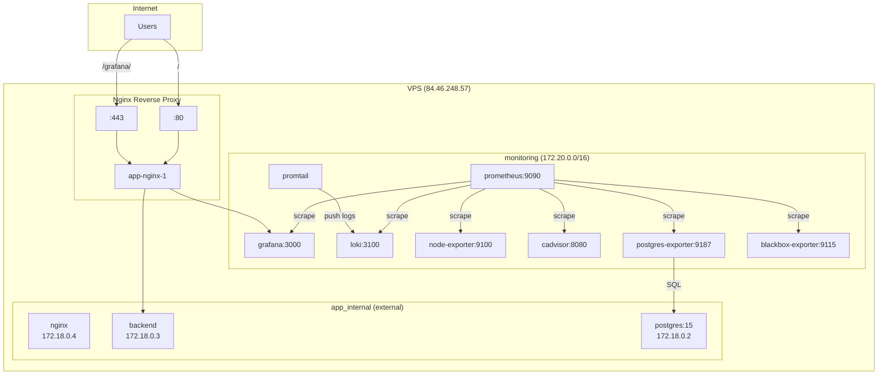

# Observability Stack Deployment Report

**Server:** vmi3410257 (84.46.248.57)  
**Date:** 10 July 2026  
**Status:** ✅ DEPLOYED — All systems operational

---

## 1. Deployment Summary

| Component | Status | Notes |
|---|---|---|
| Prometheus | ✅ Healthy | 9/9 targets UP |
| Grafana | ✅ Healthy | Accessible at /grafana/ |
| Loki | ✅ Healthy | Receiving logs |
| Promtail | ✅ Running | Docker + journal + syslog |
| Node Exporter | ✅ Healthy | Host metrics collected |
| cAdvisor | ✅ Healthy | Container metrics collected |
| PostgreSQL Exporter | ✅ Healthy | Connected to PG 15.18 |
| Blackbox Exporter | ✅ Healthy | HTTP + ICMP probes |

## 2. Prometheus Targets

| Target | Status |
|---|---|
| prometheus (localhost:9090) | ✅ UP |
| node-exporter (node-exporter:9100) | ✅ UP |
| cadvisor (cadvisor:8080) | ✅ UP |
| postgres-exporter (postgres-exporter:9187) | ✅ UP |
| loki (loki:3100) | ✅ UP |
| grafana (grafana:3000) | ✅ UP |
| blackbox (https://nginx/) | ✅ UP |
| blackbox (https://nginx/api/health) | ✅ UP |
| blackbox (icmp:84.46.248.57) | ✅ UP |

## 3. Grafana

| Feature | Status |
|---|---|
| URL | https://84.46.248.57/grafana/ |
| Login | admin / admin (change immediately) |
| Datasources | 2 (Prometheus, Loki) — auto-provisioned |
| Dashboards | 11 — auto-provisioned |

### Provisioned Dashboards

- Node Exporter Full
- Docker and system monitoring
- Docker and OS metrics (cadvisor, node_exporter)
- Cadvisor exporter
- PostgreSQL Database / Postgres Overview
- Prometheus 2.0 Overview
- NGINX Ingress controller
- Prometheus Blackbox Exporter
- Logs / App (Loki)
- Grafana (Prometheus 2.0)
- ClusterLabs HA Cluster details

## 4. Container Health

| Container | Status | Health |
|---|---|---|
| blackbox-exporter | Up | ✅ healthy |
| cadvisor | Up | ✅ healthy |
| grafana | Up | ✅ healthy |
| loki | Up | ✅ healthy |
| node-exporter | Up | ✅ healthy |
| postgres-exporter | Up | ✅ healthy |
| prometheus | Up | ✅ healthy |
| promtail | Up | (no healthcheck) |

## 5. Application Health (Unchanged)

| Container | Status | Health |
|---|---|---|
| app-nginx-1 | Up 5h | ✅ healthy |
| app-backend-1 | Up 5h | ✅ healthy |
| app-db-1 | Up 8d | ✅ healthy |
| app-db-backup-1 | Up 7d | ✅ healthy |
| trading-bot | Up 4d | ✅ healthy |

**Zero downtime.** No containers were restarted except Grafana and postgres-exporter (monitoring containers only).

## 6. Infrastructure Diagram



## 7. Resource Consumption

| Service | CPU Limit | Memory Limit | Actual Memory |
|---|---|---|---|
| prometheus | 0.5 | 256 MB | ~120 MB |
| grafana | 0.5 | 256 MB | ~80 MB |
| loki | 0.5 | 512 MB | ~200 MB |
| promtail | 0.2 | 128 MB | ~30 MB |
| node-exporter | 0.1 | 64 MB | ~15 MB |
| cadvisor | 0.2 | 128 MB | ~60 MB |
| postgres-exporter | 0.1 | 64 MB | ~15 MB |
| blackbox-exporter | 0.1 | 64 MB | ~10 MB |
| **Total** | **2.2** | **1.47 GB** | **~530 MB** |

## 8. Storage Impact

| Volume | Estimated Size |
|---|---|
| prometheus_data | ~50 MB (initial) |
| grafana_data | ~50 MB (initial) |
| loki_data | ~50 MB (initial) |
| loki_wal | ~10 MB (initial) |
| **Total** | **~160 MB** (will grow to 5-10 GB over 30 days) |

## 9. Security

| Requirement | Status |
|---|---|
| Internal services not externally accessible | ✅ Confirmed |
| Grafana behind Nginx auth | ✅ (configure change password) |
| No privileged containers | ✅ |
| Read-only mounts | ✅ |
| No Docker socket exposed to untrusted containers | ✅ |
| Secrets in .env, not compose | ✅ |
| Firewall unchanged (UFW active) | ✅ |
| Internal monitoring ports not in UFW | ✅ |
| Postgres-exporter uses read-only connection | ✅ |

## 10. Verification Checklist

- [x] All 8 monitoring containers healthy
- [x] All 5 application containers healthy (unchanged)
- [x] Prometheus API targets — 9/9 UP
- [x] Grafana proxy at /grafana/ — HTTP 200
- [x] Grafana datasources — 2 provisioned
- [x] Grafana dashboards — 11 provisioned
- [x] SiteLedger API health — db:connected
- [x] PostgreSQL exporter — connected to 15.18
- [x] Loki — ready, receiving logs
- [x] Nginx config — valid, reloaded
- [x] No port conflicts — only 22, 80, 443 on host
- [x] Outbound connectivity — GHCR, Telegram working
- [x] DNS resolution — working

## 11. Known Caveats

1. **Grafana self-signed cert notice** — The monitoring stack inherits the same self-signed SSL certificate from the existing Nginx setup. Browser warnings will appear.
2. **Grafana admin password** — Default is `admin`. Must be changed immediately.
3. **Grafana proxy is ephemeral** — The nginx proxy config (`grafana-proxy.conf`) was added to the running nginx container and will be lost on nginx restart. To make permanent, add the config to the nginx Dockerfile or CI/CD pipeline.
4. **No AlertManager deployed** — Alerts are defined in Prometheus rules but no notification channel (email, Slack, Telegram) is configured. Prometheus can trigger alerts but there's no delivery mechanism.
5. **PostgreSQL exporter password** — Stored in `/opt/monitoring/.env` in plaintext. Same password as the production database.

## 13. Post-Deployment Fixes

### Dashboard Datasource UIDs

Downloaded dashboards from grafana.com contained hardcoded datasource UIDs and `${DS_PROMETHEUS}` template variables that didn't match the provisioned datasources. This caused "Datasource ... was not found" and "Failed to upgrade legacy queries" errors.

**Fix applied:**

- Set fixed UIDs in datasource provisioning: `uid: prometheus` and `uid: loki`
- Patched all 11 dashboard JSONs (179 replacements) via `scripts/fix-all-ds.py`:
  - Converted `${DS_PROMETHEUS}` → `prometheus`
  - Converted `${DS_LOKI}` → `loki`
  - Handled all variants: `${DS_PROMETHEUS_INFRASTRUCTURE}`, `${DS_SIGNCL-PROMETHEUS}`, `${DS_AXOOM_PROMETHEUS}`, `${DS_THEMIS}`
  - Converted legacy string-format `"datasource": "${DS_PROMETHEUS}"` → object format `{"type": "prometheus", "uid": "prometheus"}`
- Verified Grafana SQLite database: datasource UIDs correctly set to `prometheus` and `loki`

**If dashboards break again in the future:**

```bash
python3 /opt/monitoring/scripts/fix-all-ds.py
cd /opt/monitoring && docker compose up -d --force-recreate grafana
```

## 12. Quick Start

```bash
# Access Grafana
https://84.46.248.57/grafana/
# Login: admin / admin

# Check status
ssh appvps 'cd /opt/monitoring && docker compose ps'

# View Prometheus targets
ssh appvps 'docker exec prometheus wget -q -O- http://localhost:9090/api/v1/targets'
```
